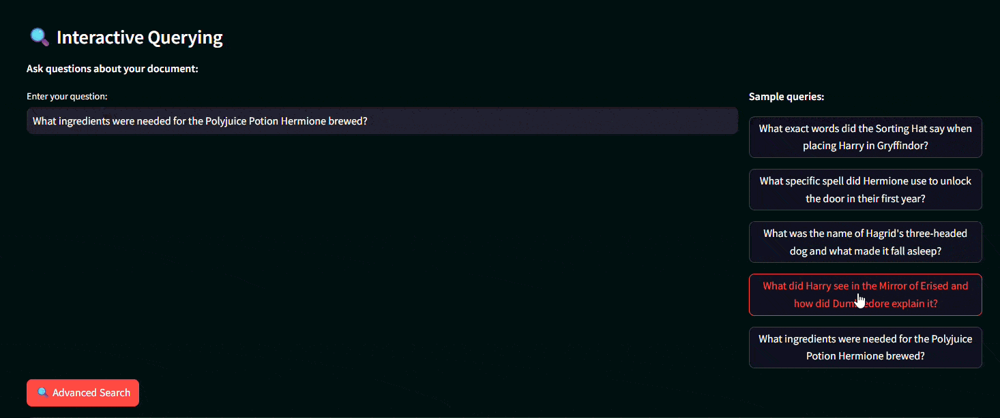
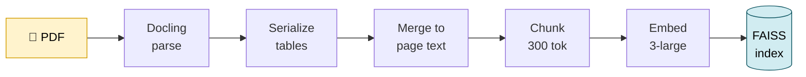
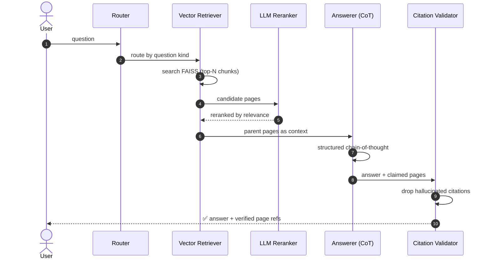

<h1 align="center">📚 Advanced Retrieval-Augmented Generation System</h1>

<p align="center">
  <strong>Ask questions about any PDF and get answers that are grounded in the source —<br/>
  with the exact pages cited, and the model's reasoning shown.</strong>
</p>

<p align="center">
  
  
  
  
  
</p>

<p align="center">
  
</p>

---

## The problem

Ask a normal chatbot *"what was the operating margin?"* about a 200-page financial report and you get a confident number with **no way to verify it** — and often it's wrong. The table got mangled during text extraction, the wrong figure got picked, and there's no citation.

This system is built to be **trustworthy**: it parses the document's real structure (including tables), retrieves the right pages, reasons step-by-step, and **cites the exact page** for every answer — then throws away any citation the model tried to invent.

---

## ⚡ See it in action

> **Question** *(real example, from `data/test_set`)*
> *"According to the annual report, what is the Operating margin (%) for Tradition at the end of the last period?"*

The system retrieves the right pages, reasons through **three different margin figures** in the table, and picks the correct one:

```text
🔎 Retrieved → pages 43–45 (Operating Review)

🧠 Reasoning
   "Page 45 contains a table showing three operating-margin metrics:
    Adjusted underlying (12.7%), Adjusted (11.4%), and Reported (9.9%).
    The question asks for plain 'Operating margin', so the Reported
    figure is the correct one."

✅ Answer        9.9
📄 Citations     Tradition annual report — pages 43, 44
```

Notice what makes this hard and what the pipeline gets right: the data lived **inside a table**, there were **three plausible numbers**, and the answer comes back **with verifiable page references** — not a bare guess.

| Question type | Example | Returns |
|---|---|---|
| 🔢 `number` | "What is the operating margin?" | `9.9` + pages |
| ✅ `boolean` | "Did the company announce a buyback?" | `true` + pages |
| 🏷️ `name` | "Largest executive compensation spend?" | name + pages |
| ⚖️ `comparative` | "Which company had higher revenue, A or B?" | answer across both reports |

---

## ✨ Key features

| Capability | What it does |
|---|---|
| 🧾 **Structure-aware PDF parsing** | [Docling](https://github.com/DS4SD/docling) extracts text, layout, and **tables as real objects** — not scrambled text. Parallelized across processes. |
| 📊 **Table serialization** | Rewrites tables into self-contained text blocks so a single figure survives chunking with its context intact. |
| 🔍 **Hybrid retrieval + LLM reranking** | FAISS vector recall, then an LLM re-scores candidates for *answer-bearing* relevance (blended score). |
| 📄 **Parent-document retrieval** | Matches on small chunks (precision) but feeds the model the full page (context). |
| 🧭 **Question router** | Each question kind gets its own schema-constrained prompt (number / name / boolean / comparative). |
| 🧠 **Structured chain-of-thought** | Every answer returns reasoning, a summary, the final value, **and** the pages it used. |
| 🛡️ **Citation validation** | Any page the model cites that wasn't actually retrieved is **stripped out** — no hallucinated sources. |
| 🔌 **Multi-provider** | OpenAI, Gemini, and IBM WatsonX behind one interface, with JSON-repair for non-strict models. |

---

## 🏗️ How it works

**Two phases.** Ingestion (offline, once per document) builds the search indexes. Querying (online, per question) routes → retrieves → reranks → answers → validates.

### Ingestion — building the index



### Querying — answering a question



> 📐 These diagrams render automatically on GitHub. For the stage-by-stage breakdown, module map, and the *why* behind each design choice, see **[ARCHITECTURE.md](ARCHITECTURE.md)**.

---

## 🖥️ The demo app

A Streamlit interface lets you watch each pipeline stage execute, inspect retrieved passages, and see citations inline.

<p align="center">
  
</p>

---

## 🚀 Quickstart

```bash
git clone https://github.com/Behz4dH/Advanced-Retrieval-Augmented-Generation-System.git
cd Advanced-Retrieval-Augmented-Generation-System
pip install -r requirements_streamlit.txt
streamlit run streamlit_app.py
```

Then in the app:
1. Open **Quick Start Guide** → pick **Pre-made Documents → Harry Potter** (uses pre-computed embeddings — instant, no full pipeline run).
2. Paste your **OpenAI API key** in the sidebar (used only for query embedding + answering).
3. Ask: *"What house was Harry Potter sorted into and why?"*

<details>
<summary><b>⌨️ Prefer the CLI? (batch processing)</b></summary>

```bash
python main.py download-models                      # one-time: fetch Docling models
python main.py parse-pdfs --parallel --max-workers 10
python main.py process-reports --config no_ser_tab  # merge → chunk → embed
python main.py process-questions --config max_nst_o3m
```

Configure keys by copying the template: `cp env .env`, then edit `.env`:
```ini
OPENAI_API_KEY=sk-...
GEMINI_API_KEY=...    # optional
JINA_API_KEY=...      # optional (reranker)
```
</details>

---

## ⚙️ Pipeline configurations

Presets in [`src/pipeline.py`](src/pipeline.py), selected with `--config`:

| Config | Retrieval | Rerank | Model | Notes |
|---|---|:---:|---|---|
| `base` | vector | – | GPT-4o-mini | fast baseline |
| `pdr` | vector + parent | – | GPT-4o | parent-document retrieval |
| `max` | vector + parent + tables | ✅ | GPT-4o | full feature set |
| **`max_nst_o3m`** | vector + parent | ✅ | o3-mini | 🏆 **best-performing** |
| `gemini_thinking` | full context | – | Gemini 2.0 Flash Thinking | long-context, no retrieval |

---

## 🗂️ Project structure

```
├── main.py                  # Click CLI: parse → process → answer
├── streamlit_app.py         # interactive demo UI
├── src/
│   ├── pipeline.py          # orchestration + all run configs
│   ├── pdf_parsing.py       # Docling: PDF → structured JSON
│   ├── tables_serialization.py
│   ├── parsed_reports_merging.py   # structured JSON → page text
│   ├── text_splitter.py     # token-aware chunking
│   ├── ingestion.py         # FAISS + BM25 index builders
│   ├── retrieval.py         # vector / BM25 / hybrid retrievers
│   ├── reranking.py         # LLM reranker
│   ├── prompts.py           # Pydantic schemas + routed prompts
│   ├── questions_processing.py     # routing, answering, citation checks
│   └── api_requests.py      # OpenAI / Gemini / IBM provider layer
└── data/
    ├── test_set/            # sample reports + questions + answers
    └── premade_embeddings/  # pre-built indexes for the demo
```

---

## 🛠️ Tech stack

**Core:** Python 3.11 · OpenAI · Google Gemini · IBM WatsonX
**Retrieval:** FAISS · rank-bm25 · LangChain (splitting)
**Parsing:** Docling · PyPDF2 · tiktoken
**Structure:** Pydantic · json-repair
**Interface:** Streamlit · Click

---

## 🙏 Acknowledgments

The core retrieval-and-answering pipeline is adapted from the **winning solution of the Enterprise RAG Challenge** (original author credited in the code as *Ilia Ris*). This repository's contribution is the **interactive Streamlit demo, pre-computed-embedding workflow, and packaging** that make the system explorable end-to-end without re-running the full pipeline. All credit for the original pipeline design belongs to the upstream author.

> 📌 **TODO:** add a link to the upstream repository here once confirmed.

---

## 📄 License

Released under the MIT License.
